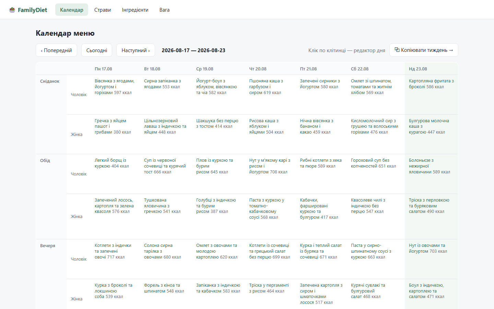
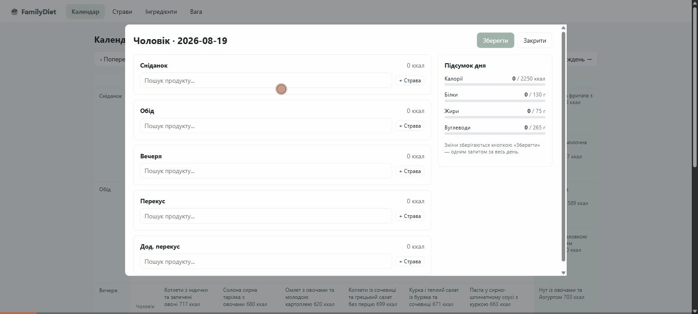
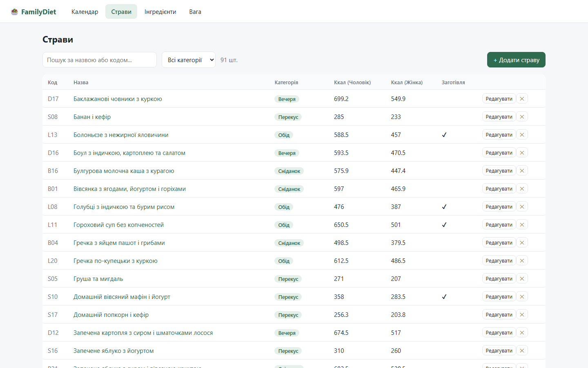
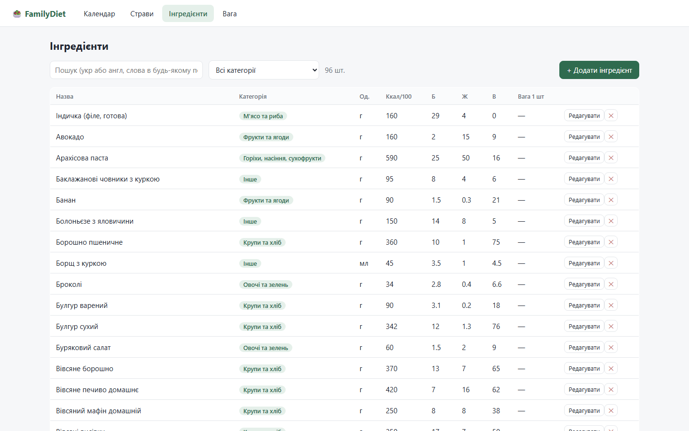
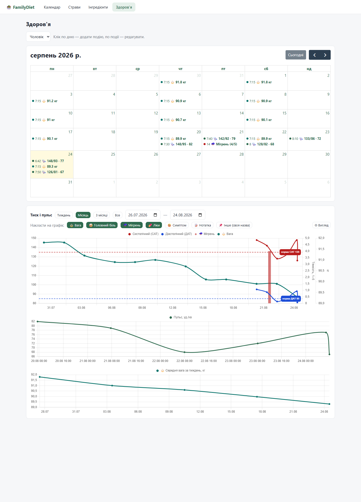

# FamilyDiet

[](https://github.com/YlikScherbak/FamilyDiet/actions/workflows/ci.yml)

Локальний застосунок ведення сімейної дієти на основі 21-денного плану харчування
від нутриціолога (сам PDF-план не публікується; страви з нього розібрані в seed-дані
та фікстури).

**Стек:** Symfony 7.4 (REST API) · Vue 3 + Vite + Pinia + vue-i18n · PostgreSQL 16 · Docker Compose.

Інтерфейс двомовний — українська (за замовчуванням) та англійська; перемикач у
шапці, вибір запам'ятовується в браузері. Календар подій, графіки і повідомлення
помилок API перемикають локаль разом з інтерфейсом (бекенд читає
`Accept-Language`, Symfony Translator).

## Запуск з нуля

```bash
make init
```

Це збере контейнери, встановить залежності, накотить міграції і засіє демо-дані
(разом з довідником USDA). Інші команди — `make help`.

Календар після сіду порожній — сім'я наповнює його сама. Для швидкого огляду
є `make demo`: заповнює меню обох на поточний тиждень і додає вісім тижнів
історії ваги (перезаписує поточний тиждень і всі записи ваги).

<details>
<summary>Без make — ті самі кроки вручну</summary>

```bash
docker compose up -d --build
docker compose exec php composer install
docker compose exec php php bin/console doctrine:migrations:migrate --no-interaction
docker compose exec php php bin/console doctrine:fixtures:load --no-interaction
docker compose exec php php bin/console app:import-usda-products
docker compose exec php php bin/console app:import-ingredient-translations
```

</details>

- Застосунок: http://localhost:5173
- API: http://localhost:8080/api/health
- PostgreSQL: `localhost:5432`, база `familydiet`, користувач/пароль `app`/`app`

Фікстури засівають: 2 членів сім'ї (з цілями ккал/БЖВ), 96 інгредієнтів з КБЖВ
та 91 страву з плану (B01-B21 сніданки, L01-L21 обіди, D01-D21 вечері,
S01-S21 перекуси, N01-N07 додаткові перекуси) з окремими порціями для кожного.
Календар меню порожній — наповнюється вручну.

`app:import-usda-products` довантажує ~7 200 продуктів з
[USDA FoodData Central](https://fdc.nal.usda.gov/) (SR Legacy, CC0;
дамп у `backend/data/usda_products.json`). `app:import-ingredient-translations`
накочує українські назви (`backend/data/usda_names_uk.csv`, ключ — `fdc_id`);
оригінал зберігається у `name_en`, пошук працює обома мовами. Обидві команди
ідемпотентні, базу НЕ очищають (на відміну від `fixtures:load`); переімпорт
продуктів не перезаписує перекладені назви.

Довідник інгредієнтів вантажиться на фронтенд один раз при старті
(`GET /api/ingredients/all` → Pinia store) — автокомпліт шукає локально,
по словах у будь-якому порядку, українською та англійською.

> `doctrine:fixtures:load` очищає базу — план меню, вага та власні страви зникнуть.
> Запускати лише для початкового наповнення.

## Скріншоти

Тижнева сітка меню на двох із підсумками калорій:



Конструктор дня — страви й окремі продукти з грамівкою, живий прогрес КБЖВ проти особистих цілей:



| Страви з порціями на кожного | Інгредієнти з КБЖВ |
| --- | --- |
|  |  |

Журнал здоров'я — події в календарі (FullCalendar) і графіки тиску/пульсу з зонами норми (Chart.js):



## Сторінки

- **Календар** — тижнева сітка меню для обох (сніданок/обід/вечеря/перекуси),
  підсумок дня ккал/БЖВ проти особистої цілі, копіювання тижня. Клік по клітинці
  відкриває **конструктор дня**: у кожен прийом додаються страви або окремі
  продукти з ручною грамівкою (гречка 150 г, курка гриль 100 г), справа — живий
  прогрес ккал/Б/Ж/В проти цілей.
- **Страви** — CRUD з порціями на кожного, рецептом, YouTube-відео та
  прапорцем «заготівля»; калорійність рахується з інгредієнтів.
- **Інгредієнти** — CRUD з КБЖВ на 100 г (для штучних — вага 1 шт).
- **Здоров'я** — журнал подій здоров'я в місячному календарі: заміри тиску/пульсу
  і ваги (структуровані поля з валідацією), головний біль і мігрень із тяжкістю
  1–5, ліки, нотатки та власні типи подій. Нижче — **універсальний графік** на
  часовій осі (пресети періоду тиждень/місяць/3 місяці): будь-які типи подій
  вмикаються чіпами й накладаються один на одного для пошуку кореляцій. Тиск і
  пульс — САТ/ДАТ з межами норми 135/85 та пульс на власній осі; вага — лінія на
  осі «кг»; тяжкість болю — точки/стовпчики/лінія на осі 1–5; події без числа —
  вертикальні маркери чи смуга на день. Колір і стиль кожного типу
  налаштовуються (⚙ Вигляд), а комбінації зберігаються як **іменовані пресети**
  («Тиск і мігрені», «Вага і тиск», «Болі та ліки», свої) — усе в БД.

## API (основне)

| Метод | Шлях | Опис |
|---|---|---|
| GET | `/api/family-members` | члени сім'ї з цілями |
| GET/POST/PUT/DELETE | `/api/ingredients` | CRUD інгредієнтів (`?search=&category=`) |
| GET/POST/PUT/DELETE | `/api/dishes` | CRUD страв з порціями (`?search=&category=`) |
| GET | `/api/meal-plan?from=&to=` | записи меню + денні підсумки |
| POST/DELETE | `/api/meal-plan/entries` | додати/прибрати страву зі слота |
| POST | `/api/meal-plan/copy` | копіювати діапазон дат |
| GET/POST/PUT/DELETE | `/api/health-events` | журнал здоров'я (`?memberId=&type=&from=&to=`) |
| GET/PUT | `/api/settings/{key}` | іменовані JSONB-налаштування (вигляд графіка тощо) |

## Структура

```
backend/    Symfony API (entities, controllers, fixtures)
frontend/   Vue 3 SPA (Vite dev server проксує /api на nginx)
docker/     php-fpm Dockerfile, nginx конфіг
.docs/      план дієти (PDF), seed JSON, план розробки
```

## Технічні рішення

- **Порції — окремо на кожного члена сім'ї.** Та сама страва в плані має різну
  грамівку для чоловіка і дружини, тому калорійність — не атрибут страви, а
  функція від порції: `dish → dish_portion (per member) → dish_portion_ingredient`.
  КБЖВ ніколи не зберігається денормалізовано — завжди обчислюється з інгредієнтів.
- **Бізнес-інваріанти — у схемі БД, а не лише в PHP:** унікальність порції на
  людину, інгредієнта в порції, ваги на дату — це unique-констрейнти; каскади
  видалення продумані окремо (довідник інгредієнтів захищений від каскаду).
- **Сирий DBAL на `/api/ingredients/all`:** гідрація 7 000+ entity займала секунди,
  тому довідник для клієнтського кешу віддається одним SQL + `json_encode` повз
  Serializer (мілісекунди). Це усвідомлений виняток, а не патерн — CRUD-ендпоінти
  працюють через ORM.
- **Довідник — один раз на клієнт.** Фронтенд вантажить усі інгредієнти в Pinia
  і шукає локально (по словах у будь-якому порядку, укр/англ) — автокомпліт без
  жодного запиту до API.
- **Атомарні операції над днем/діапазоном.** Збереження дня і копіювання тижня —
  транзакція «видалити ціль + вставити нове»: повторне збереження чи копіювання
  ідемпотентне, дублів і подвоєних калорій не буває (закріплено тестами).
- **Журнал здоров'я — одна таблиця з JSONB, а не таблиця на тип.** Подія має
  `type` + `payload` (JSONB); які поля дозволені і як валідуються — визначає
  реєстр типів на бекенді (`HealthEventTypeRegistry`). Новий структурований тип
  (цукор, температура) — це запис у реєстрі, без міграцій.
- **Залежності на фронтенді — лише за ділом.** База — Vue, Router, Pinia, Vite.
  Для журналу здоров'я свідомо взяті спеціалізовані бібліотеки: FullCalendar
  (місячна сітка подій) і Chart.js з annotation-плагіном (медичні графіки
  з зонами норми) — там, де самопис коштував би дорожче за виграш.
- **Вага — теж подія журналу.** Колишня окрема таблиця ваги мігрована в
  `health_event` (type=weight) одним SQL у міграції; тижневі середні тепер
  рахуються на клієнті з тих самих подій, а старий роут `/weight` редіректить
  на «Здоров'я».
- **Тестова ізоляція** — `dama/doctrine-test-bundle`: кожен тест у транзакції
  з відкатом, тестова БД лишається чистою без перезасіву.

## Дорожня карта

- Список закупівель за обраний період (агрегація інгредієнтів із меню) — формат обговорюється.
- Рекомендації страв: мінімізація кількості інгредієнтів на період, «використати залишки».
- Аналіз цін інтернет-магазинів.

## Ліцензія та дані

Код — [MIT](LICENSE).

Довідник продуктів (`backend/data/usda_products.json`) — вибірка з
[USDA FoodData Central](https://fdc.nal.usda.gov/), набір SR Legacy.
Дані USDA є суспільним надбанням ([CC0 1.0](https://creativecommons.org/publicdomain/zero/1.0/)):
U.S. Department of Agriculture, Agricultural Research Service. FoodData Central. fdc.nal.usda.gov.
Українські назви продуктів (`backend/data/usda_names_uk.csv`) — власний переклад.
